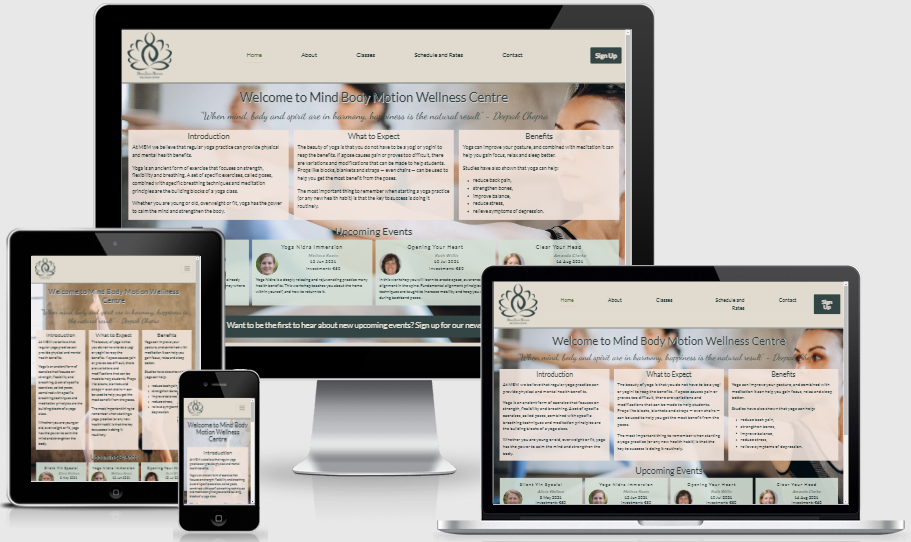

# Mind Body Motion Wellness Centre Website

[View live project here](https://elriem.github.io/CI_MS1_MBM/)

This is a business website for the Mind Body Motion Wellness Centre, a fictional fitness centre offering yoga, meditation and tai chi classes. It is designed to be responsive on a range of devices, making it easy to navigate for prospective students and existing students.

The website provides users with information about the process for joining classes, where to locate the gym, instructor biographies and a downloadable timetable.

## User Experience (UX)

### User Stories

#### First Time Visitor Goals

  1. As a First Time Visitor, I want to easily understand the main purpose of the site and learn more about the fitness centre.
  2. As a First Time Visitor, I want to be able to easily navigate throughout the website to find more information about which classes are available, their suitability and what to expect.
  3. As a First Time Visitor, I want to be able to easily navigate throughout the website to find out more about the instructors, ensuring that I am in the class I expected to attend.
  4. As a First Time Visitor, I want to be able to easily navigate throughout the website to find more information about the tariffs and package deals available.
  5. As a First Time Visitor, I want to locate social media links to see the fitness centre's social presence and find out more about other students' experiences.
  
#### Returning Visitor Goals
  
  1. As a Returning Visitor, I want to find the best way to get in contact for any queries I might have.
  2. As a Returning Visitor, I want to find information regarding registering for upcoming events.
  3. As a Returning Visitor, I want to find information about prices and buy additional class bundles.

#### Frequent User Goals
  
  1. As a Frequent User, I want to sign up to the Newsletter to be informed of upcoming events and receive health and wellbeing advice.
  2. changes to the timetable and new classes becoming available.
  3. As a Frequent User, I want to register for classes or events, and / or buy additional class bundles.

### Design

#### Colour Scheme

* The main colours, generated from colormind.io, are:
  * Light Shades (background / inverted text colour) - Spring Wood #e1dbcf
  * Light Accent (accent colour) - Hillary #ac9d81
  * Main brand colour - Granny Smith #8d9a9c
  * Dark accent (alternative accent colour) - Toast #9d736b
  * Dark shades (dark on light text colour, background) - Outer Space #334545

#### Typography

* Predominantly 2 fonts were used throughout the website:
  * The Lato font is the main font used throughout the whole website, with Sans Serif as the fallback font in case the font does not import correctly into the site. It is summarised as "Male and female, serious but friendly. With the feeling of the Summer". This fits well with the fitness centre, which should have a calm and inviting feeling, but also reflects the seriousness of wellbeing and health.
  * The Dancing Script font was selected for the quotes and class descriptions. It is described as "a lively casual script where the letters bounce and change size slightly" and ideal for a friendly, informal and spontaneous look. I selected it to bring an elegant playfulness to the design, as a compliment to the seriousness of the Lato font.

#### Imagery

* To make the website stand out, I opted for a full page background on the landing page. For responsiveness, I opted to use different background pictures for tablets and mobiles that scaled better to the device. The bright colours of the outfits, the muted backgrounds and the general beauty of the pictures engages with site visitors, immediately telling the visitor what the organisation is about.

### Wireframes

* Home page wireframe - [view](docs/wireframes/home.png)
* About page - [view](docs/wireframes/about.png)
* Classes page - [view](docs/wireframes/classes.png)
* Schedule and Rates page - [view](docs/wireframes/schedule.png)
* Contact Us page - [view](docs/wireframes/contact.png)

## Features

### Existing Features

* Responsive on all device sizes
* Interactive elements
* Form to register for events and / or classes
* Download timetable from website

### Features Left to Implement

* Interactive event registration - allows users to register for events directly from website
* Interactive class booking - allows users to book, or cancel, directly from the website
* Information about additional therapies (massage, sauna, reiki, etc.) to be added.

## Technologies Used

### Language Used

* HTML 5
* CSS

### Frameworks, Libraries & Programs Used

* Bootstrap 5:
  * Bootstrap was used to assist with the responsiveness and styling of the website:
    * Horizontal alignment navs & tabs used for navbar
    * Used stacked to horizontal grid for introduction section on home page.
    * For the image gallery on About page, used Carousel.
    * Sign up for newsletter form created with modals.
    * Classes layout uses List Group, with headings as disabled items.
  * Google Fonts:
    * Google Fonts were used to import the "Lato" and "Dancing Script" fonts into the style.css file used on all pages throughout the website.
  * Font Awesome:
    * Font Awesome was used on all pages throughout the website to add icons for aesthetic and UX purposes.
  * jQuery:
    * jQuery in conjunction with Bootstrap make the navbar, modal and carousel responsive.
  * Git:
    * Git was used for version control by utilizing the Gitpod terminal to commit to Git and Push to GitHub.
  * GitHub:
    * GitHub is used to store the projects code after being pushed from Git.
  * Microsoft Paint and Microsoft Photos:
    * Used to crop and resize images where required.
  * Microsoft Excel:
    * Used to prepared PDF schedule available for download from Schedule page.
  * Balsamiq:
    * Balsamiq was used to create the [wireframes](docs/wireframes) during the design process.

## Testing

The following tools were used to validate every page of porject to ensure there were no syntax errors in the project:

* HTML - W3C Markup Validator
* CSS - W3C CSS Validator
* Accessibility -
* Performance -

## Deployment

## Credits

### Content

* Home page:
  * "What is yoga anyway?" section was adapted from [here](https://www.nhs.uk/live-well/exercise/guide-to-yoga/).
  * "Do I Need to be Flexible?" section was adapted from [here](https://www.nhs.uk/live-well/exercise/guide-to-yoga/) and [here](https://www.nytimes.com/guides/well/beginner-yoga).
  * "Benefits of Yoga and Meditation" section was adapted from [here](https://www.nytimes.com/guides/well/beginner-yoga).
  * Events were adapted from [here](https://delightyoga.com/studio/workshops/)
  * Phone number, email address and WhatsApp contact numbers are fictional.
  * Instructor names were randomly generated [here](https://www.name-generator.org.uk/)
  * Address randomly generated from [here](https://www.fakeaddressgenerator.com/World/Netherlands_address_generator)

* About page:
  * Instructor photos were randomly generated from [here](https://thispersondoesnotexist.com/) and saved as image files.
  * Instructor descriptions were adapted from profiles on [this page](https://delightyoga.com/about/staff/teachers).
  * Instructor names (5 to 12) were randomly generated [here](https://www.name-generator.org.uk/)
  * Address randomly generated from [here](https://www.fakeaddressgenerator.com/World/Netherlands_address_generator)
  * "Quotes" copied from [here](https://www.therandomvibez.com/short-quote/)
  
  * Facilities and house rules adapted from [here](https://www.thewellnesscenter.org/newstudents)

  * Gallery images:
    * Pilates_ball (slide 2) - Photo by Andrea Piacquadio from [Pexels](https://www.pexels.com/photo/young-ethnic-woman-with-fit-ball-sitting-on-floor-while-training-in-modern-gym-3768593/)
    * Prenatal_yoga (slide7) - Photo by Gustavo Fring from [Pexels](https://www.pexels.com/photo/women-doing-yoga-3984363/)
    * Yoga_pose (slide 5) - Photo by cottonbro from [Pexels](https://www.pexels.com/photo/2-topless-women-in-black-leggings-and-black-sunglasses-4327139/)
    * Yoga_supplies (slide 6) - Photo by cottonbro from [Pexels](https://www.pexels.com/photo/woman-in-black-sports-bra-and-black-leggings-standing-beside-brown-wooden-chair-4327007/)
    * Yoga_assistance (slide 4) - Photo by Cliff Booth from [Pexels](https://www.pexels.com/photo/women-doing-yoga-4057067/)
    * Yoga_class (slide 3) - Photo by Andrea Piacquadio from [Pexels](https://www.pexels.com/photo/women-doing-a-yoga-on-yoga-mat-3775587/)
    * Yoga_class_2 (slide 1) - Photo by Elly Fairytale from [Pexels](https://www.pexels.com/photo/woman-practicing-yoga-3822692/)
    * Lounge (slide 8) - Photo by KoolShooters from [Pexels](https://www.pexels.com/photo/healthy-light-relaxation-relaxing-6246210/)
    * Locker_room (slide 9) - Photo by Polina Tankilevitch from [Pexels](https://www.pexels.com/photo/changing-room-3875514/)

* Classes page:
  * Class descriptions were adapted from [here](https://www.thewellnesscenter.org/class-descriptions) and [here](https://delightyoga.com/studio/yoga/styles) for yoga and [here](https://www.evolvewellnesscentre.com/yoga) for pilates.
  * Images for class descriptions:
    * Ashtanga Photo by Elly Fairytale from [Pexels](https://www.pexels.com/photo/women-practicing-yoga-3822305/)
    * Yoga Basics Photo by Elly Fairytale from [Pexels](https://www.pexels.com/photo/yoga-instructor-helping-a-student-3822689/)
    * Hatha Photo by Elly Fairytale from [Pexels](https://www.pexels.com/photo/women-in-sports-bras-and-leggings-doing-yoga-3822356/)
    * Vinyasa Flow Photo by Elly Fairytale from [Pexels](https://www.pexels.com/photo/yoga-instructor-helping-a-student-3822691/)
    * Restorative Yoga Photo by Elly Fairytale from [Pexels](https://www.pexels.com/photo/women-practicing-yoga-3822164/)
    * Tai Chi picture, used image of similar yoga position. Photo by Elly Fairytale from [Pexels](https://www.pexels.com/photo/women-practicing-yoga-3822171/)
    * Pilates Photo by Andrea Piacquadio from [Pexels](https://www.pexels.com/photo/three-woman-doing-an-exercises-868757/)
    * Yin Yoga Photo by Elly Fairytale from [Pexels](https://www.pexels.com/photo/women-practicing-yoga-3822165/)
    * Prenatal Yoga Photo by Gustavo Fring from [Pexels](https://www.pexels.com/photo/cheerful-group-of-pregnant-women-practicing-yoga-in-modern-studio-3984367/)

* Schedule page:
  * Timetable was adapted from [here](https://www.evolvewellnesscentre.com/timetable) for the purpose of getting a more realistic weekly class schedule.

* Contact page:
  * Guidance on how to embed Google Maps on website from [here](https://www.geeksforgeeks.org/how-to-add-google-map-inside-html-page-without-using-api-key/)

* Footer
  * Terms and Conditions:
    * Generated (free) from [here](https://www.termsandconditionsgenerator.com/), used Link with Free Hosting - [sample](https://www.termsandconditionsgenerator.com/live.php?token=VKy3BemaXxsPghO41MhO4Sc8YphEMjWW). Country = Netherlands, State = Limburg, used my email address but would likely use a MBM-hosted mailbox.
  * Privacy Policy:
    * Generated (free) from [here](https://www.privacypolicygenerator.info/), used link with Free Hosting - [sample](https://www.privacypolicygenerator.info/live.php?token=TMZncJN6UtmZohCgo5d0LPhbDvaL8e3i). Selected cookies for tracking usage (not included in this version of website), Google AdSense to reach a greater audience, no third party advertising (able to change later)

  * Sign-up modal background - Photo by Eternal Happiness from [Pexels](https://www.pexels.com/photo/photo-of-woman-posing-during-golden-hour-3326362/)

### Media

* Logo
  * Lotus flower vector from [here](https://flyclipart.com/flower-lotus-lotus-flower-icon-with-png-and-vector-format-flower-icon-png-771399)

* Cover page

  * Desktop - Photo by Elly Fairytale from [Pexels]("https://www.pexels.com/photo/woman-in-blue-sports-bra-and-white-leggings-doing-yoga-3822166/")

  * Tablet - Photo by Elly Fairytale from [Pexels] ("https://www.pexels.com/photo/woman-practicing-yoga-3822457/")

  * Mobile - Photo by Elly Fairytale from [Pexels]("https://www.pexels.com/photo/woman-practicing-yoga-3822369/")

### Acknowledgements
