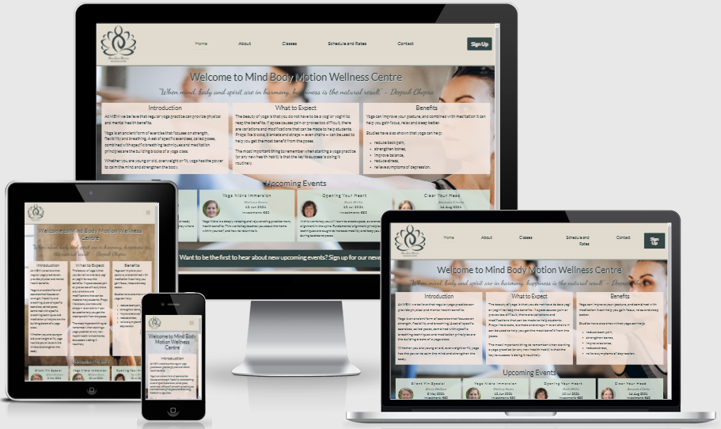

# Mind Body Motion Wellness Centre Website <!-- omit in toc -->

[View live project here](https://elriem.github.io/CI_MS1_MBM/)

# Contents <!-- omit in toc -->

- [1. User Experience (UX)](#1-user-experience-ux)
  - [1.1 Target audience](#11-target-audience)
  - [1.2 User Stories](#12-user-stories)
    - [First Time Visitor Goals](#first-time-visitor-goals)
    - [Returning Visitor Goals](#returning-visitor-goals)
    - [Frequent User Goals](#frequent-user-goals)
    - [Site Owner Goals](#site-owner-goals)
  - [1.3 Design](#13-design)
    - [Colour Scheme](#colour-scheme)
    - [Typography](#typography)
    - [Imagery](#imagery)
  - [1.4 Structure](#14-structure)
  - [1.5 Wireframes](#15-wireframes)
- [2. Features](#2-features)
  - [2.1 Existing Features](#21-existing-features)
  - [2.2 Features Left to Implement](#22-features-left-to-implement)
- [3 Technologies Used](#3-technologies-used)
  - [3.1 Language Used](#31-language-used)
  - [3.2 Frameworks, Libraries & Programs Used](#32-frameworks-libraries--programs-used)
- [4. Testing](#4-testing)
  - [4.1 Validator tools](#41-validator-tools)
  - [4.2 Testing User Stories from User Experience (UX) Section](#42-testing-user-stories-from-user-experience-ux-section)
    - [First Time Visitor Goals](#first-time-visitor-goals-1)
    - [Returning Visitor Goals](#returning-visitor-goals-1)
    - [Frequent User Goals](#frequent-user-goals-1)
    - [Site Owner Goals](#site-owner-goals-1)
      - [14. As the Site Owner, I want to inform students (existing and prospective) of upcoming events.](#14-as-the-site-owner-i-want-to-inform-students-existing-and-prospective-of-upcoming-events)
  - [4.3. Further Testing](#43-further-testing)
  - [4.4 Testing Bugs - Resolved](#44-testing-bugs---resolved)
  - [4.5 Known Bugs](#45-known-bugs)
- [5. Deployment](#5-deployment)
  - [5.1. GitHub Pages](#51-github-pages)
  - [5.2. Forking the GitHub Repository](#52-forking-the-github-repository)
  - [5.3. Making a Local Clone](#53-making-a-local-clone)
- [6. Credits](#6-credits)
  - [6.1. Code](#61-code)
  - [6.2. Content](#62-content)
  - [6.3. Media](#63-media)
  - [6.4. Acknowledgements](#64-acknowledgements)

# 1. User Experience (UX)

This is a business website for the Mind Body Motion Wellness Centre, a fictional fitness centre offering yoga, meditation and tai chi classes. It is designed to be responsive on a range of devices, making it easy to navigate for prospective students and existing students.

The website provides users with information about the process for joining classes, where to locate the gym, instructor biographies and a downloadable timetable.

## 1.1 Target audience

- People looking to take on yoga as a new hobby,
- People looking for pilates or taichi classes,
- People looking for a new yoga studio, and
- People who already use the wellness centre.

## 1.2 User Stories

### First Time Visitor Goals

  1. As a First Time Visitor, I want to easily understand the main purpose of the site and learn more about the wellness centre.
  2. As a First Time Visitor, I want to be able to easily navigate throughout the website to find more information about which classes are available, their suitability and what to expect.
  3. As a First Time Visitor, I want to be able to easily navigate throughout the website to find out more about the instructors, ensuring that I am in the class I expected to attend.
  4. As a First Time Visitor, I want to be able to easily navigate throughout the website to find more information about the tariffs and package deals available.
  5. As a First Time Visitor, I want to locate social media links to see the wellness centre's social presence and find out more about other students' experiences.
  
### Returning Visitor Goals
  
  6. As a Returning Visitor, I want to find the best way to get in contact for any queries I might have.
  7. As a Returning Visitor, I want to find information regarding registering for upcoming events.
  8. As a Returning Visitor, I want to find information about prices and buy additional class bundles.

### Frequent User Goals
  
  9. As a Frequent User, I want to sign up to the Newsletter to be informed of upcoming events and receive health and wellbeing advice.
  10. As a Frequent User, I want to be able to view changes to the timetable and new classes becoming available.
  11. As a Frequent User, I want to register for classes or events, and / or buy additional class bundles.

### Site Owner Goals

  12. As the Site Owner, I want to make information easily accessable to prospective and existing students, thereby reducing the number of queries sent and the time spent on administrative tasks.
  13. As the Site Owner, I want to provide students with the centre's processes and procedures to allow them to prepare for their visit.
  14. As the Site Owner, I want to inform students (existing and prospective) of upcoming events.

## 1.3 Design

### Colour Scheme

- The main colours, selected from  a Google search of "Yoga studio colour palette" ([link](https://www.google.com/imgres?imgurl=https://i.pinimg.com/originals/9f/7f/08/9f7f08b1a65027c50519d934f6ff7676.jpg&imgrefurl=https://nl.pinterest.com/pin/526006431486092441/&tbnid=_l_RzFZUJQFdxM&vet=1&docid=LUuDSscJX2s3YM&w=1500&h=1500&source=sh/x/im))
  - Light Shades - Fresh Linen #e1dbcf (header, accents)
  - Light Accent - Calm Pink #f2e5dd (background and accents)
  - Main brand colour - Garden Air #d4e0d6
  - Dark accent - Grateful Green #acbba6 (accents)
  - Dark shades - Moonlight Forest #334545 (text)

- Snapshot of palette image can be viewed [here](docs/readme/other/colour-palette.png).

### Typography

- When searching for fonts, I started by looking for an elegant but playful font type to represent the elegance and fluid movements in yoga, but also try to bring in an element of fun and playfulness to avoid being too "stuffy".
- Once I had selected Dancing Script, I looked at the popular pairings and selected Lato.

- Two fonts were used throughout the website:
  - The Lato font is the main font used throughout the whole website, with Sans Serif as the fallback font in case the font does not import correctly into the site. It is summarised as "Male and female, serious but friendly. With the feeling of the Summer". This fits well with the wellness centre, which should have a calm and inviting feeling, but also reflects the seriousness of wellbeing and health.

  - The Dancing Script font was selected for the quotes and class descriptions. It is described as "a lively casual script where the letters bounce and change size slightly" and ideal for a friendly, informal and spontaneous look. This fits well into the impression I wanted for the website.

### Imagery

- To make the website stand out, I opted for a full page background on the landing page.

- For responsiveness, I opted to use different background pictures for tablets and mobiles that scaled better to that device. 

- The bright colours of the outfits, the muted backgrounds and the general beauty of the pictures engages with site visitors, telling the visitor what the organisation is about and introducing the elegant playfulness of the design.

## 1.4 Structure

- During the research phase, I visited websites from the Netherlands, United Kingdom and United States to find common themes and features;
  - Timetables
  - Class descriptions
  - Class rates, and bundle packages
  - Events, usually with guest speakers or internal instructors but also yoga retreats through affiliate links
  - Facilities and rules at the yoga studio
  - Social media links, most commonly Facebook, Twitter and Instagram, but some websites also had Pinterest and YouTube presence
  - Dutch websites, and websites, often had WhatsApp contacts available

- To meet the needs identified in the User Goals, I felt the best way to present the information would be:
  - Introduction to yoga and meditation, especially for those prospective students that were "looking to try something new" and events on the landing / home page
  
  - On the About page, I put information that I felt gave you more of an overview of the wellness centre:
    - Images of instructors, with short inspirational quotes as their "motto" to give you an idea of the personality / character of the instructor and a list of the types of classes they lead. There was some overlap, and not all the classes that instructors can teach are listed with their names on the schedule. The idea with this is rotation and backup - if a instructor is not able to run their class, another instructor could take their place. It is also not uncommon for yoga instructors to be interested or trained in multiple disciplines.
    - Facilities and FAQs, which covers the topics of what is at the wellness centre, what do you need to bring with you (especially important to a prospective student, showing up to a class when there is no yoga mat available to you would be embarrassing and inconvenient and probably lead to the student never returning, thereby losing their business) and what is expected of you (again avoiding embarrassment, for instance walking into a studio with your shoes on and being reprimanded)
    - An image gallery, which gives you an idea of what to expect when you arrive, a preview of classes and an idea of the feel and space available in the wellness centre classes
  
  - Yoga classes and other classes are described on the Classes page. To make it easier for prospective students to find the right class for them, the yoga classes are split into three different levels - classes suitable for beginners, classes for a slower pace and classes with a faster pace
    - Images of the classes, what to expect in a class and suitability is included on this page

  - A class schedule, with a colour legend that ties into the classes page levels (beginner, slow-paced, fast-paced and other / special classes) and the class tariffs are included in the Schedule and Rates page
    - This is commonplace in a lot of the websites, having rates on the same page as the timetable also means you don't have to click away once you have decided on a class, or classes if you are intending regular classes
    - There is also an option to download a PDF version of the class schedule to print and pin where users most need it (great reminder of upcoming classes you might want to attend)

  - On the Contact page, users can find contact details and an enquiry form
    - Contact details include: telephone numbers (including WhatsApp), a physical address, email address and view the address on Google Maps - when clicking on Google Maps image, Google Maps is opened in a new page and users are able to get directions / navigate to the wellness centre
    - On the Enquiry Form, users submit their contact details and select from a dropdown menu the subject / nature of their enquiry (book a class, book an event, membership inquiries or other queries). This form currently submits to the CI form dump page, but would usually be linked to email addresses that send the form to different inboxes to best address the queries

## 1.5 Wireframes

- Home page  - [view](docs/wireframes/home.png)
- About page - [view](docs/wireframes/about.png)
- Classes page - [view](docs/wireframes/classes.png)
- Schedule and Rates page - [view](docs/wireframes/schedule.png)
- Contact page - [view](docs/wireframes/contact.png)

# 2. Features

## 2.1 Existing Features
- Responsive on all device sizes
- Interactive elements
- Form to register for events and / or classes
- Download timetable from website

## 2.2 Features Left to Implement

- Interactive event registration - allows users to register for events directly from website
- Interactive class booking - allows users to book, or cancel, directly from the website
- Adding information about additional therapies (massage, sauna, reiki, etc.)
- Incorporating advertising for partners with yoga retreats, through social media feed.

# 3 Technologies Used

## 3.1 Language Used

- [HTML 5](https://en.wikipedia.org/wiki/HTML5)
- [CSS](https://en.wikipedia.org/wiki/Cascading_Style_Sheets)

## 3.2 Frameworks, Libraries & Programs Used

### - [Bootstrap 5:](https://getbootstrap.com/docs/5.0/getting-started/introduction/) <!-- omit in toc -->
  - Bootstrap was used to assist with the responsiveness and styling of the website:
    - Horizontal alignment navs & tabs used for navbar
    - Used stacked to horizontal grid for introduction section on home page
    - For the image gallery on About page, used Carousel
    - Sign up for newsletter form created with modals
    - Classes layout uses List Group, with headings as disabled items
    - Contact form elements
  
 ### - [Google Fonts:](https://fonts.google.com/) <!-- omit in toc -->
  - Google Fonts were used to import the "Lato" and "Dancing Script" fonts into the style.css file used on all pages throughout the website.
  
###  - [Font Awesome:](https://fontawesome.com/) <!-- omit in toc -->
  - Font Awesome was used on all pages throughout the website to add icons for aesthetic and UX purposes.

###  - [jQuery:](https://jquery.com/) <!-- omit in toc -->
  - jQuery in conjunction with Bootstrap make the navbar, modal, accordion and carousel responsive.

###  - [Git:](https://git-scm.com/) <!-- omit in toc -->
  - Git was used for version control by utilizing the Gitpod terminal to commit to Git and Push to GitHub.

###  - [GitHub:](https://github.com/) <!-- omit in toc -->
  - GitHub is used to store the projects code after being pushed from Git.

### - [Visual Studio Code:](https://code.visualstudio.com/) <!-- omit in toc -->
  - IDE used to write code for this project.
 
###  - [Microsoft Paint](https://en.wikipedia.org/wiki/Microsoft_Paint) and [Microsoft Photos:](https://en.wikipedia.org/wiki/Microsoft_Photos) <!-- omit in toc -->
  - Used to crop and resize images where required.

###  - [Microsoft Excel:](https://en.wikipedia.org/wiki/Microsoft_Excel) <!-- omit in toc -->
  - Used to prepared PDF schedule available for download from Schedule page.

###  - [Balsamiq:](https://balsamiq.com/) <!-- omit in toc -->
  - Balsamiq was used to create the wireframes during the design process.

### - [Am I Responsive:](http://ami.responsivedesign.is/) <!-- omit in toc -->
  - Used to create mockups for README file.

# 4. Testing

## 4.1 Validator tools

The following tools were used to validate every page of project to ensure there were no syntax errors in the project:

- HTML - W3C Markup Validator
  - Pages tested:
  
  | Page | Result |
  | --- | --- |
  | Home | No errors |
  | About | No errors |
  | Classes | No errors |
  | Schedule and Rates | No errors |
  | Contact | No errors |
  | Error (404) | No errors |
  
  - Report can be found [here](docs/readme/test-results/validator-tools/html-validation.pdf).
  
- CSS - W3C CSS Validator
  - All errors / warnings relate to Bootstrap and Font Awesome.
  - Summary of result:
    - No errors or warnings from CSS style file unrelated to Bootstrap;
    - Errors from Bootstrap 5.0 (unused / unrecognised errors); and
    - Errors from FontAwesome.
  - Report can be found [here](docs/readme/test-results/validator-tools/css-validation.png).
  
- Accessibility - WAVE Web Accessibility Evaluation Tool
  - Pages tested:
  
  | Page | Result - Errors | Result - Warnings | 
  | --- | --- | --- |
  | Home | No errors | Alert for duplicate link |
  | About | No errors | Alert for duplicate link |
  | Classes | No errors | Alert for duplicate link |
  | Schedule and Rates | No errors | i) Alert for duplicate link ii) Timetable and PDF |
  | Contact | No errors | Alert for duplicate link |
  | Error (404) | No errors | Alert for duplicate link |

  - Summary of results:
    - Alert on all pages for duplicate link (logo and home both go to home page). Ignored, user expectation that clicking on the Logo will lead back to landing / home page;
    - Class Schedule, which uses a timetable and PDF download, flagged as potential problem. No changes made, schedule layout and sizing unlikely to cause reader errors from overlapping information and PDF is an optional download.
  - Report can be found [here](docs/readme/test-results/validator-tools/wave-validation.pdf).
  
- Performance - Chrome Lighthouse
  - Pages tested (mobile and desktop tested on each):
    - Home;
    - About;
    - Classes;
    - Schedule and Rates;
    - Contact; and
    - Error (404).
  - Summary of results:
    - Performance between 94 and 100;
    - Accessibility between 97 and 100;
    - Best Practices at 100;
    - SEO between 98 and 100 on all pages except landing page;
    - Landing page SEO score of 89 / 91 (desktop / mobile respectively) due to the signup block at the bottom of the screen not having a href target (links directly to modal block in banner).
  - Report can be found [here](docs/readme/test-results/validator-tools/lighthouse-validation.pdf).

## 4.2 Testing User Stories from User Experience (UX) Section

### First Time Visitor Goals

#### 1. As a First Time Visitor, I want to easily understand the main purpose of the site and learn more about the wellness centre. <!-- omit in toc -->

| Ref  |Feature | Test | Expected Result | Actual Result | Link to Results |
| ---- | --- | --- | --- | --- | --- |
| 1.1) | Background image on landing page shows a woman practicing yoga | Scroll landing page to see if the background image is clearly visible and recognisable | Image remains stationary and shows a woman / women practicing yoga on all 3 devices | Woman / Women in recognisable yoga positions remain in background on scrolling | [Results](docs/readme/test-results/user-stories/firsttime/firsttime-1_1.png) |
| 1.2) | Home page has welcome message, what to expect and benefits of yoga | Test visibility of introductory text | Text clearly visible, inside container and relevant | Text grades well on visibility scores, 3 blocks of text describe waht yoga is, what to expect when starting out, what the benefits are of attending | [Results](docs/readme/test-results/user-stories/firsttime/firsttime-1_2.png) |
| 1.3) | About page has an image gallery, showing facilities and class snapshots | View gallery, see if sufficient time allowed between image changes, check buttons to skip to prev or next image works | 3 images per slide on tablet and desktop devices, 5 seconds before slide change and buttons to skip to next or return to previous. Mobile device has single image per slide, 3 seconds between slides and buttons to skip to next or return to previous slide | Slide buttons worked on all devices, slide timings as expected. Images clearly visible (good resolution) and no overlap with other sections | [Results](docs/readme/test-results/user-stories/firsttime/firsttime-1_3.png) | 
| 1.4) | Navigation bar with links to About page, Classes page, Schedule and Rates page and Contact page | Test links on navigation bar to various pages | Clicking on links opens selected page | All links clicked from each page, all went to selected page | [Results](docs/readme/test-results/user-stories/firsttime/firsttime-1_3.png) | Sufficient time to view 3 pictures or single pictures (device-size dependent), indicators allow going back to previous slide or on to next slide | Indicators allow for returning to previous slides or skipping to next slide, 5 seconds on slides with 3 images, 3 second on slides with single picture. All images visible. | [Results](docs/readme/test-results/user-stories/firsttime/firsttime-1_4.png) |

#### 2. As a First Time Visitor, I want to be able to easily navigate throughout the website to find more information about which classes are available, their suitability and what to expect. <!-- omit in toc -->

| Ref  |Feature | Test | Expected Result | Actual Result | Link to Results |
| ---- | --- | --- | --- | --- | --- |
| 2.1) | Users can visit the Classes page from the navigation bar on the top of the screen, but also from the footer   | Test whether links from navbar and footer follow through to Classes page | Navigation links open Classes page | Navigation links in footer and navigation bar lead to classes page, tested from all pages. Classes page remains on page when selected. | [Results](docs/readme/test-results/user-stories/firsttime/firsttime-2_1.png) |
| 2.2) | Users can find detailed descriptions of classes on Classes page and representative class pictures | Confirm that all classes have a description, descriptions are fully visible and easy to read and images load properly | Class descriptions with image appear on devices, all clearly visible. | With the exception of Meditation, which is a non-guided class and in line with findings on other websites doesn't usually have a description, all classes in the Class schedule were described and images alinged and not overlapping text | [Results](docs/readme/test-results/user-stories/firsttime/firsttime-2_2.png) |
| 2.3) | Classes page is split between Yoga classes and Other classes, with Yoga classes split into 3 different levels | Review whether class descriptions and classification agree to headings (beginner = Yoga Basics + Vinyasa Flow Yoga; slow-paced = Restorative Yoga + Yin Yoga; fast-paced = Ashtanga Yoga + Hatha Yoga; Other = Prenatal Yoga + TaiChi + Pilates) | Classes appear in same sections across different viewpoints in line with aforementioned classifications. | Yoga classes, divided into beginner classes, slow-paced and fast-paced classes and Other classes. Classes included in each section and remain in that section across different devices | [Results](docs/readme/test-results/user-stories/firsttime/firsttime-2_3.png) |
  
 #### 3. As a First Time Visitor, I want to be able to easily navigate throughout the website to find out more about the instructors, ensuring that I am in the class I expected to attend. <!-- omit in toc -->

| Ref  |Feature | Test | Expected Result | Actual Result | Link to Results |
| ---- | --- | --- | --- | --- | --- |
| 3.1 | Users can visit the About page from the navigation bar on the top of the screen to view Instructor photos and descriptions | Test whether links from navbar and footer follow through to About page | Navigation link opens About page | Navigation link in navigation bar leads to About page, tested from all pages. About page remains on page when selected. | [Results](docs/readme/test-results/user-stories/firsttime/firsttime-3_1.png) |
| 3.2 | About page shows all instructors (12 at time of writing), with a photo, quote to live by and list of classes led. | Review page on all devices to confirm all 12 instructor descriptions appear, photo clearly visible and quote and class appears beneath photo | Instructor "cards" with name above, photo, quote and class list - 6 per row on desktop / laptop devices, 5 per row on tablets and 2 per row on mobile devices | Card details as expected, 6 per row on desktop and laptop devices, 5 per row on tablet and 2 per row on mobile devices | [Results](docs/readme/test-results/user-stories/firsttime/firsttime-3_2.png) |

#### 4. As a First Time Visitor, I want to be able to easily navigate throughout the website to find more information about the tariffs and package deals available. <!-- omit in toc --> 

| Ref  |Feature | Test | Expected Result | Actual Result | Link to Results |
| ---- | --- | --- | --- | --- | --- |
| 4.1 | Users can visit the Schedule and Rates page from the navigation bar on the top of the screen, but also from the footer | Test whether links from navbar and footer follow through to Schedule and Rates page | Navigation links open Schedule and Rates page | Navigation links in footer and navigation bar lead to Schedule and Rates page, tested from all pages. Schedule and Rates page remains on page when selected.| [Results](docs/readme/test-results/user-stories/firsttime/firsttime-4_1.png) |
| 4.2 | Schedule and Rates page has a table containing a breakdown of prices per class and packages | Schedule and Rates page shows prices per class and packages. | Table containing prices per class and packages appear at the bottom of each device's Schedule and Rates page | Table appears beneath Schedule as expected. | [Results](docs/readme/test-results/user-stories/firsttime/firsttime-4_2.png)                                                                                 |
     
#### 5. As a First Time Visitor, I want to locate social media links to see the wellness centre's social presence and find out more about other students' experiences. <!-- omit in toc -->
   
| Ref  |Feature | Test | Expected Result | Actual Result | Link to Results |
| ---- | --- | --- | --- | --- | --- |
| 5.1 | Footer includes "Let's Connect" with links to Facebook, Twitter and Instagram | Test links on all pages to confirm they land on correct page and in a new window | All 3 links open new windows for Facebook landing page, Twitter landing page and Instagram landing page | Footers on all pages tested, clicking opened a new web browser to the relevant social media website's landing pages | [Results](docs/readme/test-results/user-stories/firsttime/firsttime-5_1.png) |
  
### Returning Visitor Goals
  
#### 6. As a Returning Visitor, I want to find the best way to get in contact for any queries I might have. <!-- omit in toc -->

| Ref  |Feature | Test | Expected Result | Actual Result | Link to Results |
| ---- | --- | --- | --- | --- | --- |
| 6.1) | Users can visit the Contact page from the navigation bar on the top of the screen, but also from the footer | Test whether links from navbar and footer follow through to Contact page | Navigation links open Contact page | Navigation links in footer and navigation bar lead to Contact page, tested from all pages. Contact page remains on page when selected. | [Results](docs/readme/test-results/user-stories/returning/returning-6_1.png)|
| 6.2) | Enquiry form on contact page with dropdown menu for different subjects to get queries to the appropriate person | Contact page contains an Enquiry form with dropdown options for subject  | Test whether Enquiry form submits with different subjects selected | Successfully submitted Enquiry form on different devices with different subjects selected | [Results](docs/readme/test-results/user-stories/returning/returning-6_2.png) |

### 7. As a Returning Visitor, I want to find information regarding registering for upcoming events. <!-- omit in toc -->

| Ref  |Feature | Test | Expected Result | Actual Result | Link to Results |
| ---- | --- | --- | --- | --- | --- |
| 7.1) | Home page contains Upcoming Events section with events for the next 4 months (3 on tablet) | View Upcoming Events section on Home page, check layout and details all showing with no overlap | Events appearing in blocks under Upcoming Events heading at the bottom of the Home page, showing instructor, date and price | 4 events (inline on dektop, stacked in mobile) and 3 events (inline on tablet) showing all details and instructor image as expected | [Results](docs/readme/test-results/user-stories/returning/returning-7_1.png) |
| 7.2) | Enquiry form has subject for booking events | Check dropdown menu in Enquiry form contains Register an Event option on all devices | Dropdown options include "Register for an Event" | Dropdown option "Register for an  Event" appears as expected. | [Results](docs/readme/test-results/user-stories/returning/returning-7_2.png) |
| 7.3) | Button in Header (desktops) and subscribe banner on Home page to subscribe for newsletter to receive updates in inbox | Test functioning of signup  modal | Signup modal submits to Code Institute Form Dump | Form appears from button on all pages (desktop only) and home page banner link on all devices | [Results](docs/readme/test-results/user-stories/returning/returning-7_3.png) |
   
#### 8. As a Returning Visitor, I want to find information about prices and buy additional class bundles. <!-- omit in toc -->

| Ref  |Feature | Test | Expected Result | Actual Result | Link to Results |
| ---- | --- | --- | --- | --- | --- |
| 8.1) | Users can visit the Schedule and Rates page from the navigation bar on the top of the screen, but also from the footer | Test whether links from navbar and footer follow through to Schedule and Rates page | Tested in 4.1 and 4.2 of Test 4. First Time User:  Navigation links open Schedule and Rates page | Navigation links in footer and navigation bar lead to Schedule and Rates page. Schedule and Rates page remains on page when selected. | [Results test 4.1](docs/readme/test-results/user-stories/firsttime/firsttime-4_1.png)    [Results test 4.2](docs/readme/test-results/user-stories/firsttime/firsttime-4_2.png) |

### Frequent User Goals
  
#### 9. As a Frequent User, I want to sign up to the Newsletter to be informed of upcoming events and receive health and wellbeing advice. <!-- omit in toc -->
     
| Ref  |Feature | Test | Expected Result | Actual Result | Link to Results |
| ---- | --- | --- | --- | --- | --- |
| 9.1) |Button in Header (desktops) and subscribe banner on Home page to subscribe for newsletter to receive updates in inbox | Test functioning of signup modal | Signup modal submits to Code Institute Form  Dump | Tested in 7.3 of Test 7. Returning User:   Form appears from button on all pages (desktop only) and home page banner link on all  devices | [Results](docs/readme/test-results/user-stories/returning/returning-7_3.png) |
     
#### 10. As a Frequent User, I want to be able to view changes to the timetable and new classes becoming available. <!-- omit in toc -->

| Ref  |Feature | Test | Expected Result | Actual Result | Link to Results |
| ---- | --- | --- | --- | --- | --- |
| 10.1) | A class schedule is available on the Schedule and Rates page                 | View schedule on all devices, checking that information is visible and easy to read | Schedule appears in single page on Desktop and Tablet, horizontal scrolling on Mobile | Schedule appears as expected (all on one screen on Desktop and Tablet, scrolls on Mobile), colours agree to legend, message with link below legend directs user to register in Booking form | [Results](docs/readme/test-results/user-stories/frequent/frequent-10_1.png) |
| 10.2) | PDF version of class schedule can be downloaded from Schedule and Rates page | Test link on all devices| PDF download starts when link clicked, opens in new browser page | PDF document successfully downloaded and opened from each device | [Results](docs/readme/test-results/user-stories/frequent/frequent-10_2.png) |

#### 11. As a Frequent User, I want to register for classes or events, and / or buy additional class bundles. <!-- omit in toc -->

| Ref  |Feature | Test | Expected Result | Actual Result | Link to Results |
| ---- | --- | --- | --- | --- | --- |
| 11.1 |  Enquiry form on contact page with dropdown menu for different subjects to get queries to the appropriate person | Contact page contains an Enquiry form with dropdown options for subject  | Tested in 6.2 of Test 6. Frequent User:  Test whether Enquiry form submits with different subjects selected | Successfully submitted Enquiry form on different devices with different subjects selected | [Results](docs/readme/test-results/user-stories/returning/returning-6_2.png) |
| 11.2 | | 7.2) | Enquiry form has subject for booking events | Check dropdown menu in Enquiry form contains Register an Event option on all devices | Dropdown options include "Register for an Event" | Tested in 7.2 of Test 7. Returning Visitor:    Dropdown option "Register for an  Event" appears as expected. | [Results](docs/readme/test-results/user-stories/returning/returning-7_2.png) |

### Site Owner Goals

#### 12. As the Site Owner, I want to make information easily accessable to prospective and existing students, thereby reducing the number of queries sent and the time spent on administrative tasks. <!-- omit in toc -->

| Ref  |Feature | Test | Expected Result | Actual Result | Link to Results |
| ---- | --- | --- | --- | --- | --- |
| 12.1) | About page has an image gallery, showing facilities and class snapshots | View gallery, see if sufficient time allowed between image changes, check buttons to skip to prev or next image works | 3 images per slide on tablet and desktop devices, 5 seconds before slide change and buttons to skip to next or return to previous. Mobile device has single image per slide, 3 seconds between slides and buttons to skip to next or return to previous slide | Tested in 1.3 of Test 1. First Time User:    Slide buttons worked on all devices, slide timings as expected. Images clearly visible (good resolution) and no overlap with other secitons | [Results](docs/readme/test-results/user-stories/firsttime/firsttime-1_3.png) | 
| 12.2) | Navigation bar with links to About page, Classes page, Schedule and Rates page and Contact page | Test links on navigation bar to various pages | Clicking on links opens selected page | Tested in 1.4 of Test 1. First Time User:    All links clicked from each page, all went to selected page | [Results](docs/readme/test-results/user-stories/firsttime/firsttime-1_3.png) | Sufficient time to view 3 pictures or single pictures (device-size dependent), indicators allow going back to previous slide or on to next slide | Indicators allow for returning to previous slides or skipping to next slide, 5 seconds on slides with 3 images, 3 second on slides with single picture. All images visible. | [Results](docs/readme/test-results/user-stories/firsttime/firsttime-1_4.png) |

#### 13. As the Site Owner, I want to provide students with the centre's processes and procedures to allow them to prepare for their visit. <!-- omit in toc -->

| Ref  |Feature | Test | Expected Result | Actual Result | Link to Results |
| ---- | --- | --- | --- | --- | --- |
| 13.1) | About page has a Facilities & FAQs section where users can find out what is provided at the wellness centre, "rules of conduct" in the studios and other frequently asked questions | Testing was performed on the functioning of the accordion in 12.1 of Test 12. Site Owner | Facilities, Before the Lesson, During the Lesson and After the Lesson sections appear on all devices, no information cut off when accordion is open | Contents displayed as expected on all devices | [Results](docs/readme/test-results/user-stories/siteowner/siteowner-13.1.png) |

#### 14. As the Site Owner, I want to inform students (existing and prospective) of upcoming events.

| Ref  |Feature | Test | Expected Result | Actual Result | Link to Results |
| ---- | --- | --- | --- | --- | --- |
|14.1) | Home page contains Upcoming Events section with events for the next 4 months (3 on tablet) | View Upcoming Events section on Home page, check layout and details all showing with no overlap | Events appearing in blocks under Upcoming Events heading at the bottom of the Home page, showing instructor, date and price | Tested in 7.1 of Test 7. Returning Visitor:    4 events (inline on dektop, stacked in mobile) and 3 events (inline on tablet) showing all details and instructor image as expected | [Results](docs/readme/test-results/user-stories/returning/returning-7_1.png) |
|14.2) | Button in Header (desktops) and subscribe banner on Home page to subscribe for newsletter to receive updates in inbox | Test functioning of signup  modal | Signup modal submits to Code Institute Form Dump | Tested in 7.3 of Test 7. Returning Visitor:    Form appears from button on all pages (desktop only) and home page banner link on all devices | [Results](docs/readme/test-results/user-stories/returning/returning-7_3.png) |

## 4.3. Further Testing

- The website was tested on Google Chrome, Internet Explorer and Microsoft Edge.
- The website was viewed on a variety of devices, including:
  - iPhone Xs,
  - iPhone 11s,
  - Lenovo ThinkPad P53,
  - Toshiba Satellite L850-F33V,
  - Dell Inspiron 15 5515 with 24" Dell monitor.
- Significant testing was performed to ensure all pages linked correctly.
- Friends and family were asked to review the site and documentation to point out bugs and /or user experience issues.

## 4.4 Testing Bugs - Resolved

| Bug Found | Solution |
| --- | ---- |
| Footer on pages with insufficient content to fill the whole page (contact page and 404 page) would not stay fixed at the bottom. | After reading various blogs, I combined a solution from [FreeCodeCamp](https://www.freecodecamp.org/news/how-to-keep-your-footer-where-it-belongs-59c6aa05c59c/) and [Medium](https://medium.com/@zerox/keep-that-damn-footer-at-the-bottom-c7a921cb9551): viewheight set as a minimum height, and using Google Developer Tools, I calculated how much to remove (in pixels) to push the footer to the bottom of the page. |
| Table (Classes schedule) would not scroll left and right. | Reapplied table formatting from [Bootstrap 5.0](https://getbootstrap.com/docs/5.0/content/tables/) line by line. |
| Bootstrap elements (Gallery, Accordion, Modal) would not work as expected. | Copied Bootstrap 5.0 scripts to the bottom of all pages. |
| Instructor cards breaking unevenly on Laptop viewpoint | Changed margin and padding and applied flex auto margin to fill spaces evenly. |

## 4.5 Known Bugs

- The website is not optimised for Internet Explorer. No additional work was performed to optimise the site for IE as (extended) support has ended for customers since January 2020 and no further development of IE is expected.
- Dropdown list in Contact page Enquiry form: items highlighted in blue. Could not locate the correct item to change the formatting.

# 5. Deployment

## 5.1. GitHub Pages

The project was deployed to GitHub Pages as follows:

1. Log in to GitHub and locate the [GitHub Repository](https://github.com/ElrieM/CI_MS1_MBM)
2. Locate the "Settings" button in the menu above the Repository.
   - Alternatively, click [here](https://docs.github.com/en/pages/getting-started-with-github-pages/creating-a-github-pages-site) from the "Creating your site" section for a description of the process.
3. Scroll down the Settings page until you locate the "GitHub Pages" section.
4. In the "Source" section, select the dropdown "Branch:" dropdown and select "Main".
5. The page refreshes automatically.
6. Scroll to "Your site is published at..." for the puslished site link in the "GitHub Pages" section.

## 5.2. Forking the GitHub Repository

A fork is a copy of the repository, allowing you to experiment with changes without affecting the original project.

1. Log in to GitHub and locate the [GitHub Repository](https://github.com/ElrieM/CI_MS1_MBM)
2. In the banner above the Repository, click on the "Fork" button.
3. If you have succeeded, you now have a copy of the original repository in your GitHub account.

## 5.3. Making a Local Clone

A clone allows you to create a local copy of a repository on your computer and sync between your computer and the GitHub repository.

1. Log in to GitHub and locate the [GitHub Repository](https://github.com/ElrieM/CI_MS1_MBM)
2. Click on Code, click on the copy button  next to HTTPS to copy the URL.
3. Open Git Bash.
4. Change the current working directory to the location where the cloned directory should be stored.
5. Type "git clone', then paste the URL copied in step 2.
6. Press Enter to create a local clone.

Alternatively, click [here](https://docs.github.com/en/github/creating-cloning-and-archiving-repositories/cloning-a-repository-from-github/cloning-a-repository) for a guide to clone a repository.

# 6. Credits

## 6.1. Code

- Bootstrap 5: Bootstrap Library used to make the site responsive using the Bootstrap Grid System
- W3schools.com used for making changes to formatting and customising Bootstrap content used.
- mdbootstrap.com for Carousel multiple items [here](https://mdbootstrap.com/snippets/jquery/ascensus/135508#html-tab-view)
- freecodecamp.org for understanding why the footer won't stay put [here](https://www.freecodecamp.org/news/how-to-keep-your-footer-where-it-belongs-59c6aa05c59c/) and [here](https://css-tricks.com/couple-takes-sticky-footer/)

## 6.2. Content

- Home page:
  - "Introduction" section was adapted from [here](https://www.nhs.uk/live-well/exercise/guide-to-yoga/).
  - "What to Expect" section was adapted from [here](https://www.nhs.uk/live-well/exercise/guide-to-yoga/) and [here](https://www.nytimes.com/guides/well/beginner-yoga).
  - "Benefits" section was adapted from [here](https://www.nytimes.com/guides/well/beginner-yoga).
  - Events were adapted from [here](https://delightyoga.com/studio/workshops/)
  - Instructor names were randomly generated [here](https://www.name-generator.org.uk/)

- About page:
  - Instructor names (5 to 12) were randomly generated [here](https://www.name-generator.org.uk/)
  - Address randomly generated from [here](https://www.fakeaddressgenerator.com/World/Netherlands_address_generator)
  - "Quotes" copied from [here](https://www.therandomvibez.com/short-quote/)
  
  - Facilities and house rules adapted from [here](https://www.thewellnesscenter.org/newstudents)

- Classes page:
  - Class descriptions were adapted from [here](https://www.thewellnesscenter.org/class-descriptions) and [here](https://delightyoga.com/studio/yoga/styles) for yoga and [here](https://www.evolvewellnesscentre.com/yoga) for pilates.

- Schedule page:
  - Timetable inspiration from [here](https://www.evolvewellnesscentre.com/timetable) for the purpose of getting a more realistic weekly class schedule.

- Contact page:
  - Phone number, email address and WhatsApp contact numbers are fictional.
  - Address randomly generated from [here](https://www.fakeaddressgenerator.com/World/Netherlands_address_generator)
  - Guidance on how to embed Google Maps on website from [here](https://www.geeksforgeeks.org/how-to-add-google-map-inside-html-page-without-using-api-key/)

## 6.3. Media

- Logo used in header
  - Lotus flower person vector from [here](https://www.pngkey.com/download/u2e6a9t4t4i1o0u2_lotus-zen-comments-you-need-care-too-self/)

- Cover page(s):

  - Desktop - Photo by Elly Fairytale from [Pexels](https://www.pexels.com/photo/woman-in-blue-sports-bra-and-white-leggings-doing-yoga-3822166/)

  - Tablet - Photo by Elly Fairytale from [Pexels](https://www.pexels.com/photo/woman-practicing-yoga-3822457/)

  - Mobile - Photo by Elly Fairytale from [Pexels](https://www.pexels.com/photo/woman-practicing-yoga-3822369/)

- Sign-up modal background - Photo by Eternal Happiness from [Pexels](https://www.pexels.com/photo/photo-of-woman-posing-during-golden-hour-3326362/)

- Instructor photos were randomly generated from [here](https://thispersondoesnotexist.com/) and saved as image files.

- Gallery images:
  - Pilates_ball (slide 2) - Photo by Andrea Piacquadio from [Pexels](https://www.pexels.com/photo/young-ethnic-woman-with-fit-ball-sitting-on-floor-while-training-in-modern-gym-3768593/)
  - Prenatal_yoga (slide7) - Photo by Gustavo Fring from [Pexels](https://www.pexels.com/photo/women-doing-yoga-3984363/)
  - Yoga_pose (slide 5) - Photo by cottonbro from [Pexels](https://www.pexels.com/photo/2-topless-women-in-black-leggings-and-black-sunglasses-4327139/)
  - Yoga_supplies (slide 6) - Photo by cottonbro from [Pexels](https://www.pexels.com/photo/woman-in-black-sports-bra-and-black-leggings-standing-beside-brown-wooden-chair-4327007/)
  - Yoga_assistance (slide 4) - Photo by Cliff Booth from [Pexels](https://www.pexels.com/photo/women-doing-yoga-4057067/)
  - Yoga_class (slide 3) - Photo by Andrea Piacquadio from [Pexels](https://www.pexels.com/photo/women-doing-a-yoga-on-yoga-mat-3775587/)
  - Yoga_class_2 (slide 1) - Photo by Elly Fairytale from [Pexels](https://www.pexels.com/photo/woman-practicing-yoga-3822692/)
  - Lounge (slide 8) - Photo by KoolShooters from [Pexels](https://www.pexels.com/photo/healthy-light-relaxation-relaxing-6246210/)
  - Locker_room (slide 9) - Photo by Polina Tankilevitch from [Pexels](https://www.pexels.com/photo/changing-room-3875514/)

- Images for class descriptions:
  - Ashtanga Photo by Elly Fairytale from [Pexels](https://www.pexels.com/photo/women-practicing-yoga-3822305/)
  - Yoga Basics Photo by Elly Fairytale from [Pexels](https://www.pexels.com/photo/yoga-instructor-helping-a-student-3822689/)
  - Hatha Photo by Elly Fairytale from [Pexels](https://www.pexels.com/photo/women-in-sports-bras-and-leggings-doing-yoga-3822356/)
  - Vinyasa Flow Photo by Elly Fairytale from [Pexels](https://www.pexels.com/photo/yoga-instructor-helping-a-student-3822691/)
  - Restorative Yoga Photo by Elly Fairytale from [Pexels](https://www.pexels.com/photo/women-practicing-yoga-3822164/)
  - Tai Chi picture, used image of similar yoga position. Photo by Elly Fairytale from [Pexels](https://www.pexels.com/photo/women-practicing-yoga-3822171/)
  - Pilates Photo by Andrea Piacquadio from [Pexels](https://www.pexels.com/photo/three-woman-doing-an-exercises-868757/)
  - Yin Yoga Photo by Elly Fairytale from [Pexels](https://www.pexels.com/photo/women-practicing-yoga-3822165/)
  - Prenatal Yoga Photo by Gustavo Fring from [Pexels](https://www.pexels.com/photo/cheerful-group-of-pregnant-women-practicing-yoga-in-modern-studio-3984367/)

- ReadME further reading [UX Design using the Five Planes Method](https://medium.com/designcentered/ux-design-5-planes-method-b1b1d6587c05)

- ReadME layout examples:
  - [Code Institute Example](https://github.com/Code-Institute-Solutions/readme-template)
  - [Natalie Kate - Haunted](https://github.com/natalie-kate/haunted/blob/master/README.md)
  - [Tara Thoseyn - Cardiff Swim Centre](https://github.com/TaraRhoseyn/CI_MS1_CardiffSwimCentre)

## 6.4. Acknowledgements

- My mentor for helpful feedback and some supportive words when I was overwhelmed.
- My partner for enduring countless "poepie, wat van die" (loosely translates to "honey, what do you think of this") and patience.
- My brothers for words of encouragement and their support.
